# 🇧🇷 Brazil Business Intelligence Platform

An end-to-end data engineering and analytics portfolio project that ingests, transforms, and visualizes data from Brazil's two largest public datasets — the Federal Revenue (RFB) CNPJ registry and the Brazilian Institute of Geography and Statistics (IBGE) — on a modern cloud lakehouse stack.

---

## 📊 Overview

The platform answers questions about the Brazilian business landscape and demographic distribution by combining:

- **~70 million CNPJ registrations** from Receita Federal do Brasil (RFB)
- **Population, area, and economic activity data** from IBGE APIs
- **GeoJSON boundaries** for all 5,570+ municipalities and 27 states

The result is an interactive Streamlit dashboard with a translated UI (Português / English) that lets you explore where businesses concentrate, which economic sectors dominate each region, and how population density correlates with business activity. Data values such as CNAE descriptions and municipality names remain in Portuguese, as they originate from Brazilian public registries.

---

## ❓ Questions this platform answers

### 🏭 Economic Activity

- How many establishments exist per state and municipality?
- Where is a CNAE selection (section, division, group, class, or subclass) most concentrated across states and municipalities?
- How does business concentration compare when normalized per 100k inhabitants or per km²?
- What share of establishments are headquarters vs. branches?
- How many belong to Simples Nacional or MEI tax regimes?

### 👥 Demographics

- What is the population and demographic density across all Brazilian states and municipalities?


---

## 🏗️ Architecture

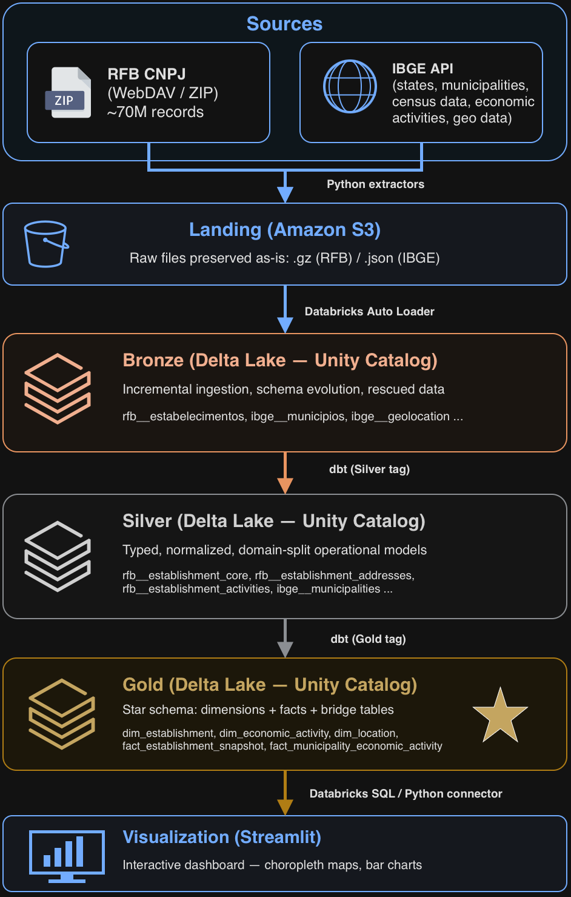

---

## 📥 Data Sources

### 🧾 Receita Federal do Brasil (RFB) — CNPJ

- **URL:** `https://arquivos.receitafederal.gov.br` (WebDAV)
- **Format:** ZIP archives containing semicolon-delimited CSV files (ISO-8859-1)
- **Frequency:** Monthly snapshots
- **Streams extracted:** `empresas`, `estabelecimentos`, `socios`, `simples`, `cnaes`, `motivos`, `municipios`, `naturezas`, `paises`, `qualificacoes`
- **Extraction strategy:** Concurrent pipeline with 3 download workers → 3 prepare workers → 4 upload workers; idempotent (skips already-uploaded zip indexes)

### 🗺️ IBGE — Instituto Brasileiro de Geografia e Estatística

- **URL:** `https://servicodados.ibge.gov.br`
- **Format:** JSON / GeoJSON
- **Frequency:** On-demand (re-extractable at any time)
- **Streams extracted:**

| Stream | Endpoint | Description |
|---|---|---|
| `estados` | `/api/v1/localidades/estados` | All 27 states with region metadata |
| `municipios` | `/api/v1/localidades/municipios` | ~5,570 municipalities with state/region hierarchy |
| `resultados` | `/api/v1/pesquisas/indicadores/{ids}/resultados/{loc}` | Population (census 2022), estimated population (2025), area — ~5,600 requests |
| `cnaes` | `/api/v2/cnae/subclasses` | Full CNAE subclass list with codes and descriptions |
| `geolocation` | `/api/v4/malhas/paises/BR` | GeoJSON boundaries for country, states, and municipalities |

---

## 🏞️ Lakehouse Layers

### 📦 Landing (S3)

Raw, immutable source files. Decouples extraction from ingestion. Organized with source-driven partition conventions (`_reference_month=YYYY-MM`, `_extraction_ts=...`).

### 🥉 Bronze (Delta Lake)

First managed layer. Ingested via Databricks Auto Loader (`cloudFiles`). Preserves source fidelity, enables schema evolution and rescued data. Adds `_ingestion_ts` and `_source_file` metadata.

### 🥈 Silver (Delta Lake + dbt)

Cleaned, typed, normalized, domain-split models. Each Bronze stream can produce multiple Silver models (e.g. `rfb__estabelecimentos` → `rfb__establishment_core`, `rfb__establishment_addresses`, `rfb__establishment_activities`, `rfb__establishment_contacts`).

### 🥇 Gold (Delta Lake + dbt)

Business-oriented star schema. Dimensions, facts, and bridge tables optimized for analytical consumption and BI workloads.

#### Dimensions

| Model | Description |
|---|---|
| `dim_establishment` | CNPJ establishment with status, type, size, legal nature |
| `dim_company` | Parent company (matriz) data |
| `dim_economic_activity` | CNAE hierarchy (section → subclass) |
| `dim_location` | Brazilian states and municipalities |
| `dim_location_geolocation` | GeoJSON geometries for choropleth maps |
| `dim_company_size` | Company size classification (MEI, ME, EPP, …) |
| `dim_legal_nature` | Legal nature codes and descriptions |
| `dim_registration_status` | Registration status codes |
| `dim_registration_status_reason` | Reason codes for status changes |
| `dim_qualification` | Partner qualification codes |
| `dim_country` | Country codes and names |

#### Facts

| Model | Description |
|---|---|
| `fact_establishment_snapshot` | Monthly snapshot of all establishments with full dimensional context |
| `fact_municipality_economic_activity` | Aggregated establishment counts by municipality × CNAE |
| `fact_location_demographics` | Population and area indicators by location and year |

#### Bridge Tables

| Model | Description |
|---|---|
| `bridge_establishment_economic_activity` | Many-to-many between establishments and their secondary CNAEs |
| `bridge_rfb_ibge_municipalities` | Municipality code mapping between RFB and IBGE registries |

---

## ⚙️ Databricks Jobs

Three jobs orchestrate the full pipeline end-to-end:

| Job | Tasks | Trigger |
|---|---|---|
| `rfb_ingestion_and_transform` | Bronze ingestion (Auto Loader, CSV/ISO-8859-1) → dbt Silver (rfb) | Manual / scheduled |
| `ibge_ingestion_and_transform` | Bronze ingestion (Auto Loader, JSON multiline) → dbt Silver (ibge) | Manual / scheduled |
| `business_transform` | dbt Gold (all gold models) | After both Silver jobs complete |

All jobs use Databricks Asset Bundles (DAB) deployed with `databricks bundle deploy -t prod`.

---

## 📈 Visualization Dashboard

Interactive Streamlit app served from the `visualization/` directory.

### 🏭 Page: Economic Activity

Explores the distribution of CNAE-classified establishments across Brazilian states and municipalities.

**Filters:** CNAE hierarchy (section → subclass) · activity type · status · ignore MEI · states or municipalities  
**Metrics:** total establishments · headquarters · branches · Simples Nacional · MEI  
**Units:** absolute count · local share · per 100k inhabitants · per km²

---

**Filters and display controls**

Select a CNAE level (section down to 6-digit subclass), activity type, visualization mode (map, chart, or table), metric, and normalization unit.

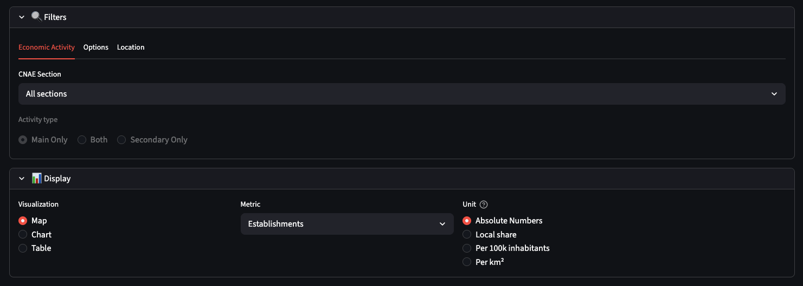

---

**How many active establishments exist per state?**

With no CNAE filter applied, São Paulo and Minas Gerais lead in raw establishment counts.

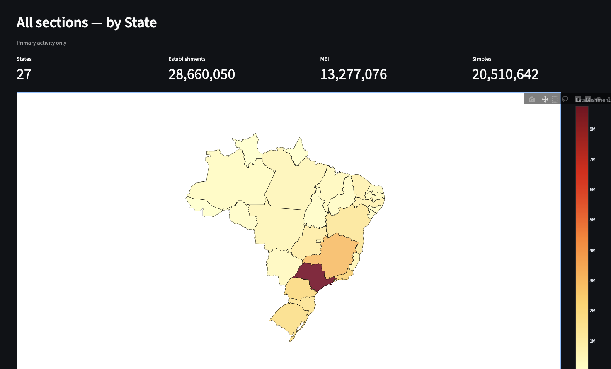

Normalizing the same view per 100k inhabitants reshuffles the ranking, surfacing Centro-Oeste and Sul states that are less visible in absolute terms.

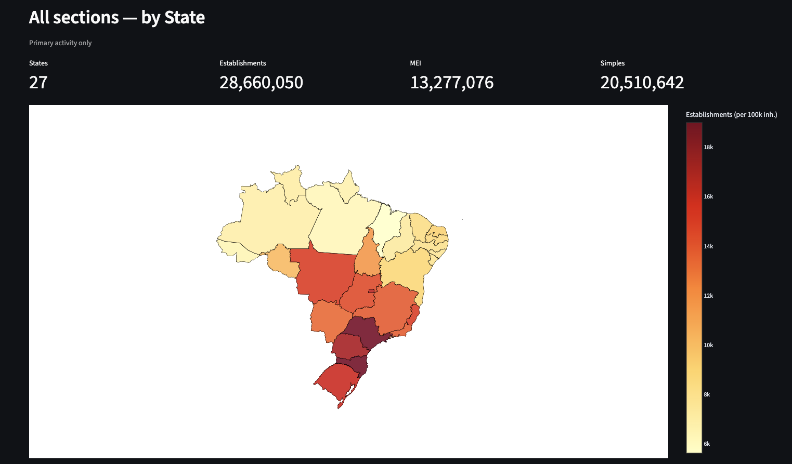

Hovering any state or municipality reveals a detail card with IBGE code, region, and establishment/headquarters/branch/tax-regime counts.

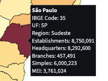

---

**Where does a given CNAE selection concentrate across the country?**

Drilling into subclass `9313100 – Atividades de Condicionamento Físico` (🏋️ fitness centers) for Santa Catarina shows the saturation of an economic activity within a given state — establishments per 100k inhabitants across the state's 295 municipalities.

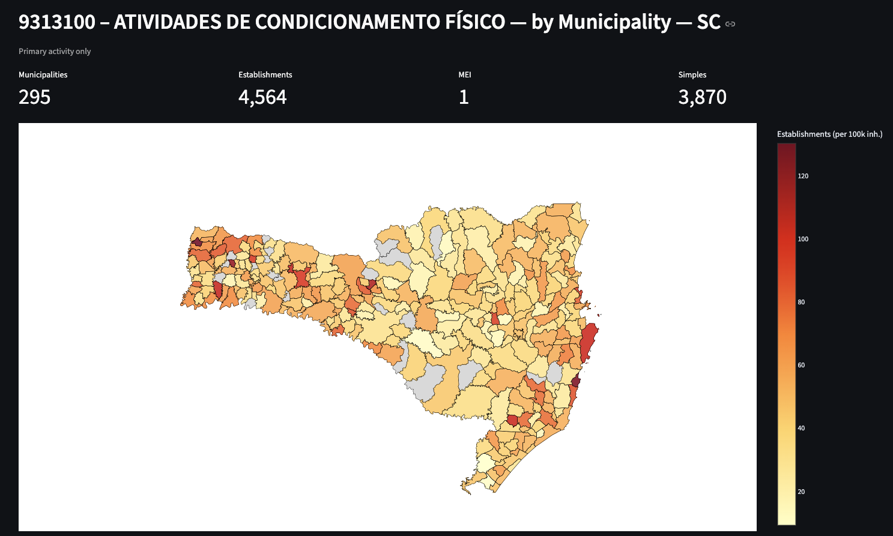

Subclass `1112700 – Fabricação de Vinho` (🍷 wine manufacturing) shown as a share of each municipality's local economy in Rio Grande do Sul lets us see where a given economic activity has the largest share relative to other activities in that state, highlighting the Serra Gaúcha wine region.

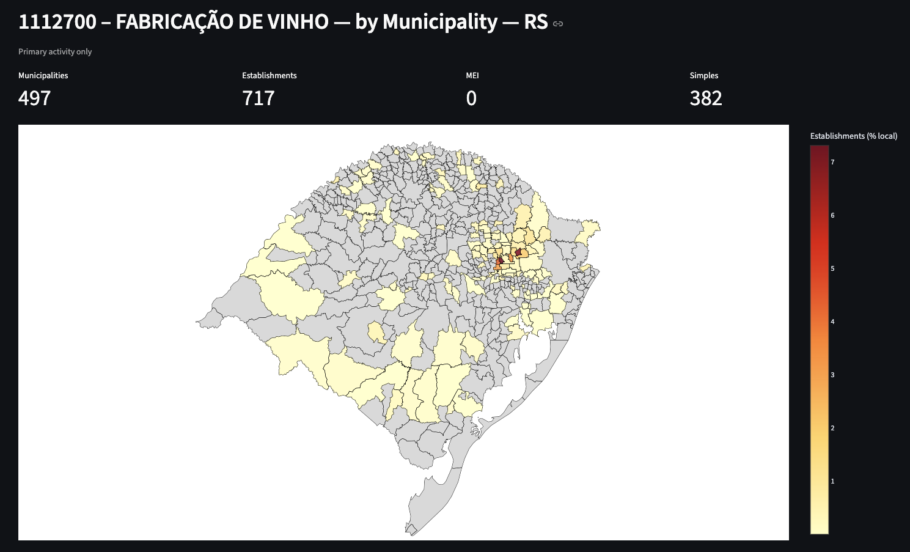

---

**Which municipalities in a state concentrate the most activity for a CNAE selection?**

Division `01 – Agricultura, Pecuária e Serviços Relacionados` (🌾 agriculture, livestock, and related services) in Mato Grosso, normalized by branches per km². Every view in this dashboard is available as a map, chart, or table — shown here as a choropleth map and as a sortable table.

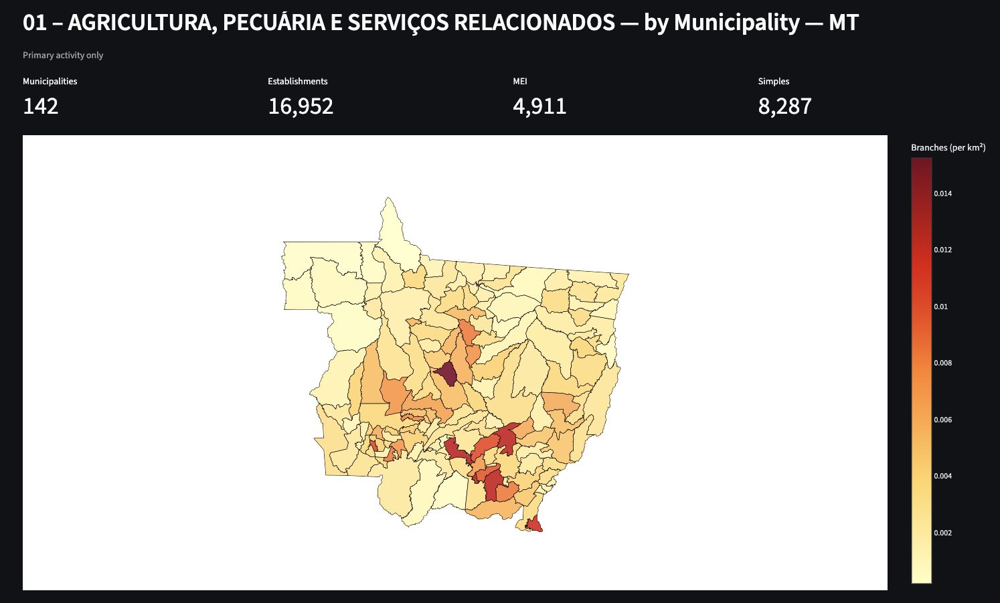

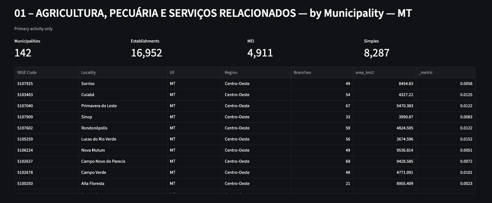

---

### 👥 Page: Demographics

Explores population and demographic density across Brazilian states and municipalities.

**Filters:** year · states or municipalities  
**Metrics:** population · demographic density (inh/km²)

---

**Filters and display controls**

Select a reference year, visualization mode (map, chart, or table), and metric (population or density).

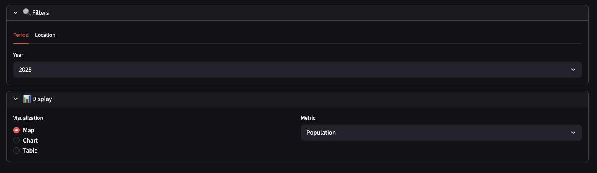

---

**What is the population across all Brazilian states?**

São Paulo and Minas Gerais concentrate the largest populations among Brazil's 27 states.

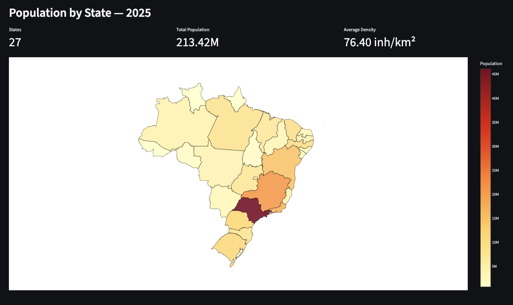

Hovering a state shows a detail card with population, density, and area — here, Minas Gerais.

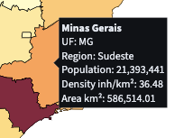

---

**How is population distributed across a state's municipalities?**

Drilling into Rio de Janeiro's 92 municipalities, shown as a choropleth map and as a sortable table.

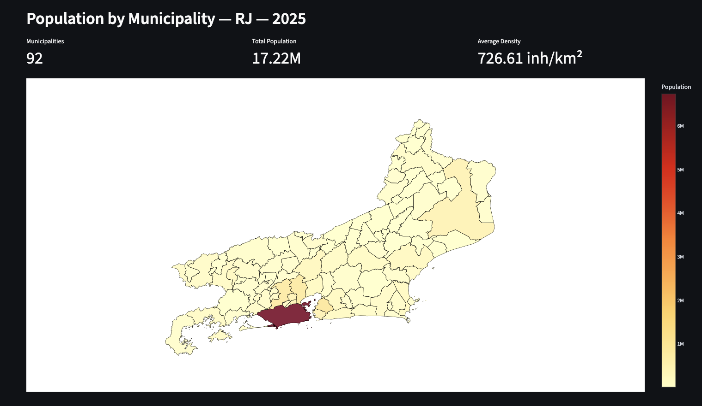

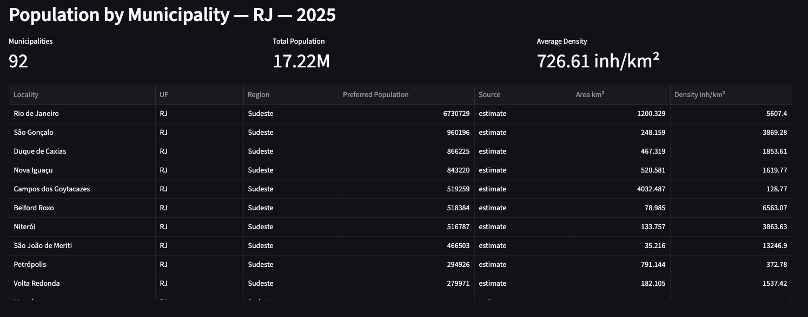

---

**How does demographic density vary across a state's municipalities?**

The same drill-down switched to the density metric, as a choropleth map and as a top-50 ranked bar chart — Baixada Fluminense municipalities dominate density despite trailing Rio de Janeiro's capital in total population.

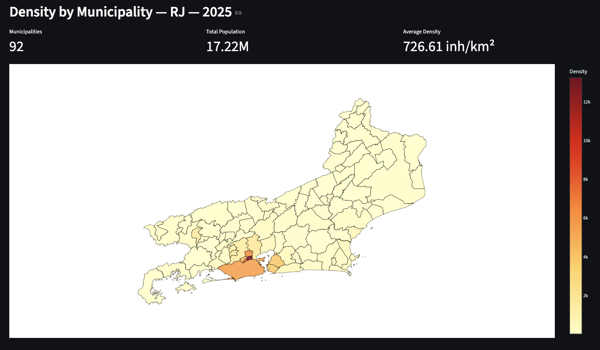

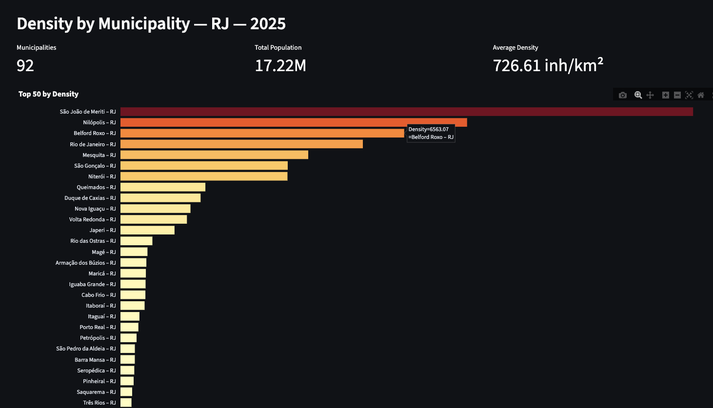

---

### Dashboard Features

- Translated UI (Português / English) with browser language auto-detection — data values (CNAE names, locations) remain in Portuguese
- Choropleth maps with click-to-filter metric cards
- Color scale aligned between map and bar chart (yellow → dark red)
- Metadata footer showing last pipeline update date and RFB reference month

---

## 🛠️ Tech Stack

| Layer | Technology |
|---|---|
| Extraction | Python 3, `requests`, `boto3`, concurrent threading pipeline |
| Storage | Amazon S3 (Landing), Databricks Unity Catalog Delta Lake (Bronze/Silver/Gold) |
| Orchestration | Databricks Asset Bundles, Databricks Workflows |
| Ingestion | Databricks Auto Loader (`cloudFiles`) — PySpark |
| Transformation | Databricks SQL via dbt |
| Visualization | Streamlit, Plotly, Folium / Pydeck |
| Infrastructure | Terraform (AWS S3, IAM, Databricks Unity Catalog — schemas, storage credentials, external locations) |
| Cloud | Databricks on AWS |

---

## 📁 Project Structure

```
.
├── extraction/                     # Python extractors (RFB + IBGE → S3)
│   ├── extractor_handler.py
│   ├── rfb/extractor.py            # RFB CNPJ WebDAV concurrent pipeline
│   ├── ibge/extractor.py           # IBGE API extractor (5 streams)
│   └── utils/                      # HTTP client, S3 handler, compression
│
├── databricks/                     # Databricks Asset Bundle
│   ├── databricks.yml              # Bundle root
│   ├── ingestion/autoloader/       # PySpark Auto Loader ingestion script
│   ├── jobs/                       # Job definitions (rfb, ibge, gold)
│   ├── targets/                    # Per-environment variables
│   └── transformation/dbt/         # dbt project
│       ├── models/
│       │   ├── silver/ibge/        # 5 IBGE Silver models
│       │   ├── silver/rfb/         # 15 RFB Silver models
│       │   └── gold/               # 16 Gold models (dims + facts + bridges)
│       ├── macros/                 # RFB business rules, SK generation, dedup
│       └── seeds/                  # Static reference tables
│
├── visualization/                  # Streamlit dashboard
│   ├── app.py                      # App shell, routing, language selector
│   ├── queries.py                  # Databricks SQL queries
│   ├── i18n.py                     # PT/EN translation strings
│   ├── map.py                      # Choropleth map helpers
│   ├── db.py                       # Databricks connection
│   └── tabs/
│       ├── economic_activity.py    # Economic Activity page
│       └── demographics.py        # Demographics page
│
└── docs/
    ├── images/                     # README screenshots and diagrams
    ├── lakehouse_layer_architecture.md # Layer definitions and responsibilities
    ├── naming_convetions.md        # Naming rules for all layers
    └── testing_conventions.md      # dbt test conventions
```

---

## 🚀 Running Locally

### ⬇️ Extraction

```bash
cd extraction
pip install -r requirements.txt

# RFB
python extractor_handler.py --source rfb --s3-bucket my-bucket --s3-prefix landing/rfb

# IBGE
python extractor_handler.py --source ibge --s3-bucket my-bucket --s3-prefix landing/ibge
```

### 🧩 Databricks Bundle

```bash
cd databricks

# Deploy
databricks bundle deploy -t prod

# Run individual jobs
databricks bundle run -t prod rfb_ingestion_and_transform
databricks bundle run -t prod ibge_ingestion_and_transform
databricks bundle run -t prod business_transform
```

### Visualization

```bash
cd visualization
pip install -r requirements.txt
streamlit run app.py
```

Requires `.streamlit/secrets.toml` with Databricks connection credentials (see `.streamlit/secrets.toml.example`).

---

## 🔗 dbt Lineage

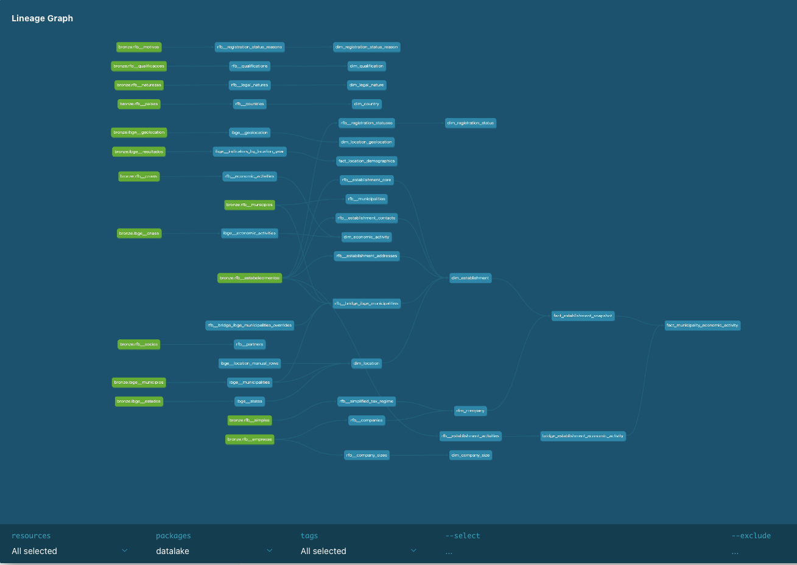

---

## 📚 Documentation

- [dbt Docs](https://albertnb.github.io/brazil-business-intelligence-platform/)
- [Lakehouse Layer Architecture](docs/lakehouse_layer_architecture.md)
- [Naming Conventions](docs/naming_convetions.md)
- [Testing Conventions](docs/testing_conventions.md)
- [Databricks Bundle](databricks/README.md)
- [Visualization Layer](visualization/README.md)
